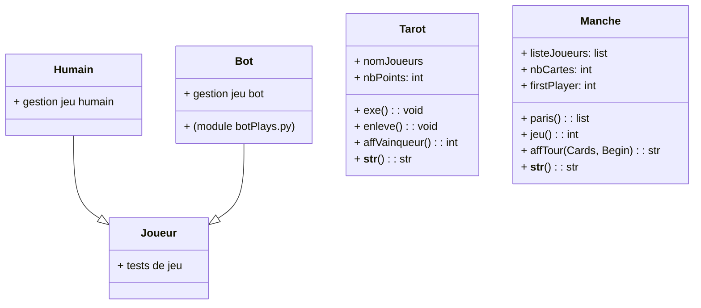

```mermaid
classDiagram
    Humain --|> Joueur
    Bot --|> Joueur
    class Tarot{
        + nomJoueurs
        + nbPoints: int
        + exe(): void
        + enleve(): void
        + affVainqueur() : int
        + __str__() : str
    }
    
    class Manche{
        + listeJoueurs: list
        + nbCartes: int
        + firstPlayer: int
        + paris(): list
        + jeu(): int
        + affTour(Cards, Begin): str
        + __str__() : str 
    }
    
    class Joueur {
        + tests de jeu
    }
    
    class Humain{
        + gestion jeu humain
    
    }
    
    class Bot{
        + gestion jeu bot 
        + (module botPlays.py)
    }
    
```